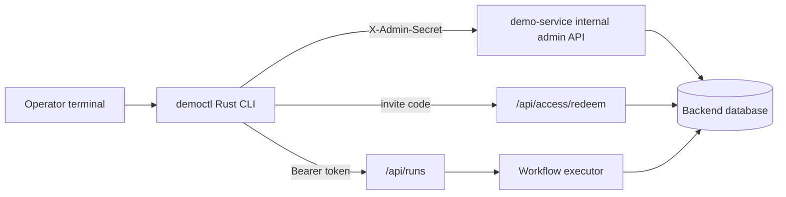

# democtl

`democtl` is a small Rust CLI for local demo-service operator workflows. It calls the existing backend APIs and does not validate invitation codes, sign tokens, run workflows, or touch the database directly.

## Architecture



## Setup

Run commands from this directory:

```bash
cd demo-service/local/democtl
cargo test
cargo run -- --help
```

The CLI does not start the backend. Point it at a running backend with environment variables or flags:

```bash
export DEMOCTL_BASE_URL=http://127.0.0.1:8000
export DEMOCTL_ADMIN_SECRET=stupid-codex-invention
```

Global flags:

```bash
--base-url http://127.0.0.1:8000
--admin-secret "$DEMOCTL_ADMIN_SECRET"
--token "$ACCESS_TOKEN"
--token-file .democtl-token
--json
```

## Sample Commands

Invitation admin:

```bash
cargo run -- admin invites list
cargo run -- admin invites create --label messy-notes --max-uses 1
cargo run -- admin invites deactivate --id 123
cargo run -- admin invites stats
```

Access token flow:

```bash
cargo run -- access redeem --code demo-abc123 --save-token .democtl-token
cargo run -- access verify --token-file .democtl-token
```

Run flow:

```bash
cargo run -- runs create --title "Rust smoke test" --token-file .democtl-token
cargo run -- runs ingest --run-id 1 --text-file samples/messy-notes.txt --token-file .democtl-token
cargo run -- runs submit --run-id 1 --token-file .democtl-token
cargo run -- runs summary --run-id 1 --token-file .democtl-token
cargo run -- runs events --run-id 1 --token-file .democtl-token
```

Input guardrail check:

```bash
cargo run -- guardrails check --token-file .democtl-token --fixtures samples/guardrails
```

The guardrail check uses explicit multipart MIME types to exercise the backend rejection paths without storing real media fixtures in the repo.

## Fixtures

```text
# samples/messy-notes.txt
Decision: Keep the Rust CLI scoped to operator workflows.
Claim: The backend remains the source of truth for invite validation.
Action: Add README examples and guardrail checks before using this in demos.
```

```text
# samples/guardrails/accepted.txt
This plain UTF-8 note should be accepted by the demo ingestion path.
```

```text
# samples/guardrails/unsupported.json
{"image": "pretend", "note": "JSON upload should not be accepted as a supported phase input."}
```

The image and audio fixtures are text placeholders:

```text
# samples/guardrails/rejected-image-placeholder.png.txt
This is a text placeholder used by democtl while sending an explicit image/png multipart content type.
```

```text
# samples/guardrails/rejected-audio-placeholder.mp3.txt
This is a text placeholder used by democtl while sending an explicit audio/mpeg multipart content type.
```

## Project Tasks

From `demo-service`:

```bash
task democtl:test
task democtl:build
task democtl:run -- admin invites list
```
